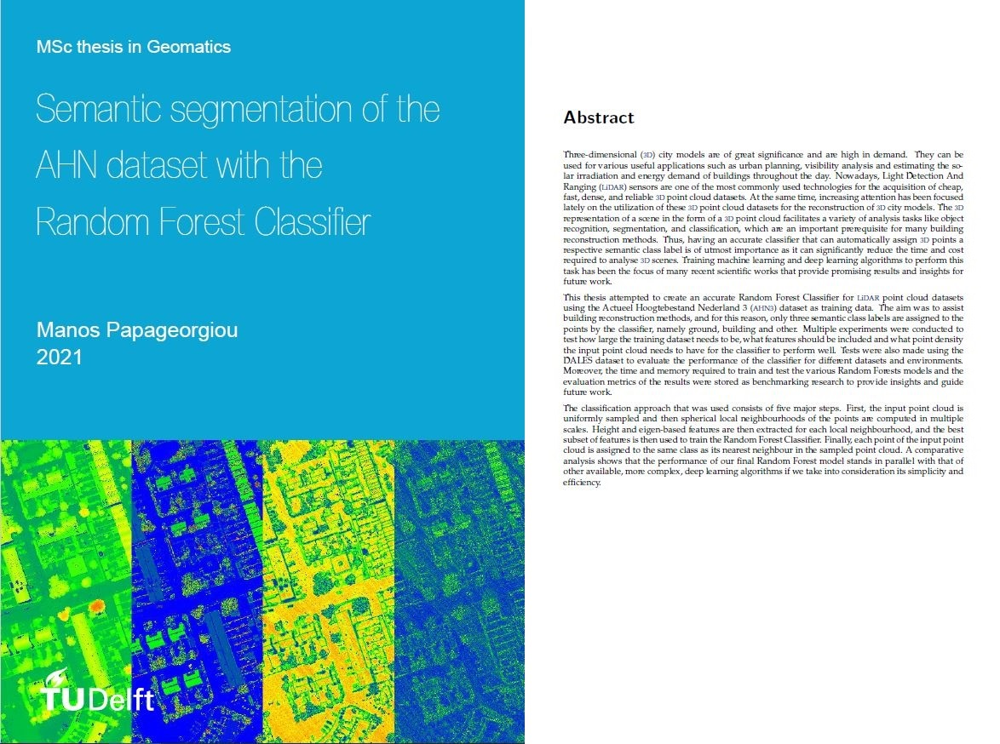

# Semantic segmentation of the AHN dataset with the Random Forest Classifier

This gihub repository contains the code to train and test Random Forest models for point cloud classification as mention in the thesis of Manos Papageorgiou.
The thesis is submitted to the Delft Univerity of Technology in partial fulfillment of the requirements for the degree of Master of Science in Geomatics. Defended on September 14, 2021.

Supervisors:
1. Ravi Peters
2. Weixiao Gao




## How to run
Set up virtual environment for Python using Anaconda.
Install dependencies with 

```bash
pip install -r requirements.txt
```

You may experience problems when installing the following packages Fiona, PDAL, CGAL (python bindings). Try installing them through the Anaconda Navigator.
